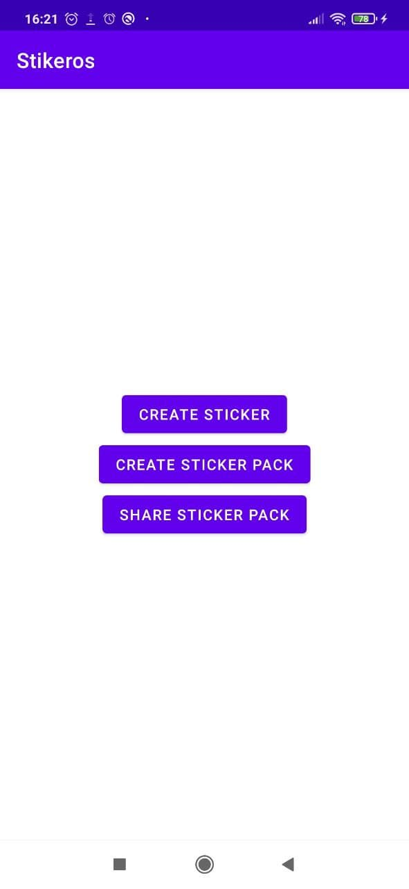
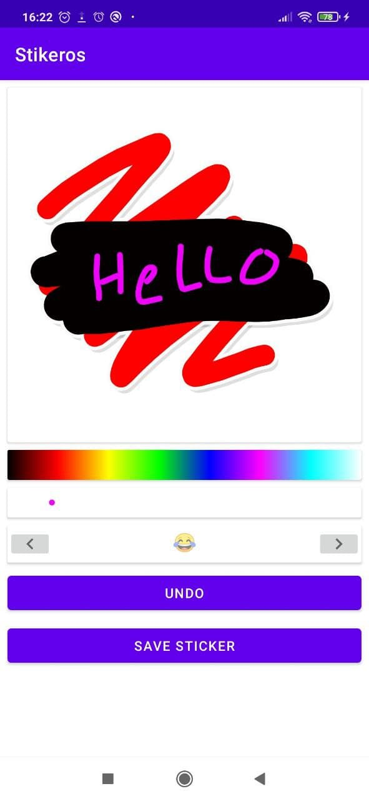
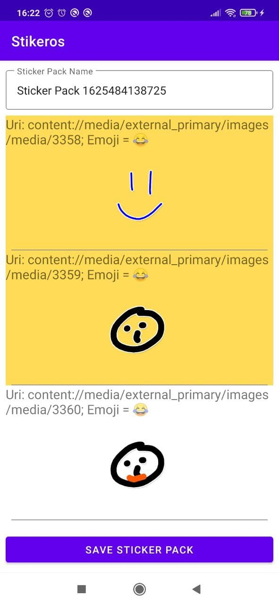
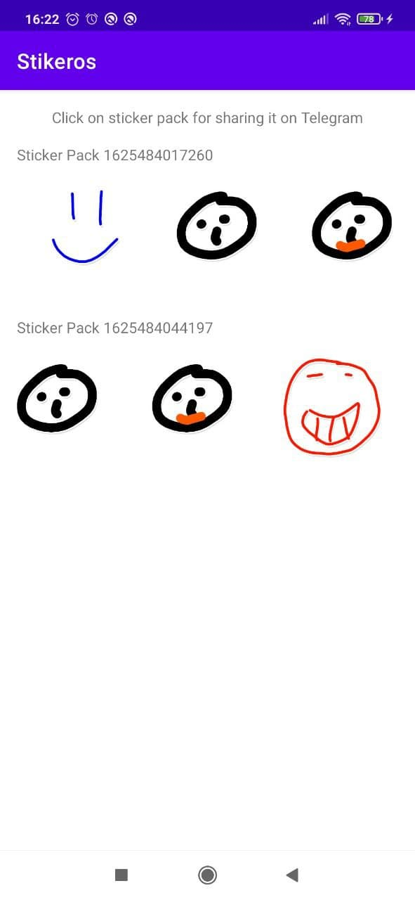

# **Telegram Contest: Android Sticker App for Telegram**

### Create unique stickers and import them to Telegram.

1. Draw stickers using colored brush
2. Group them in sticker pack
3. Share it to Telegram

**GIF and Screenshots:**

Main Screen:

Create Sticker Screen:

Create Sticker Pack Screen:

Share Sticker Pack Screen:

